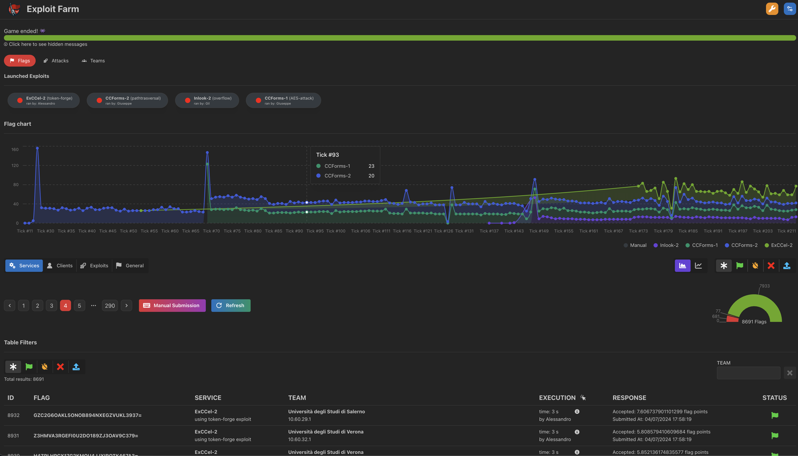
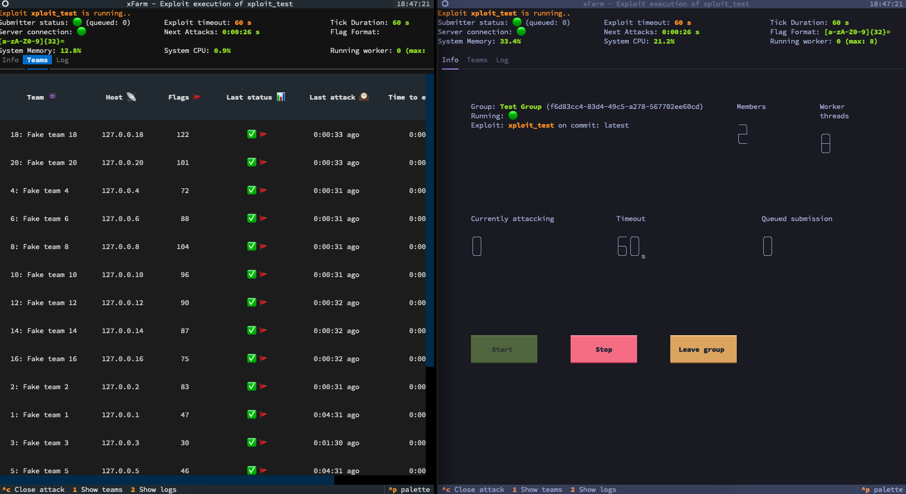

<h1><br />ExploitFarm 👾</h1>

<a href="https://github.com/Pwnzer0tt1/exploitfarm/releases/latest"></a>   

You can see a demo [here](https://demo.xfarm.pwnzer0tt1.it/)

<br />

## What is ExploitFarm?

Exploit Farm is an attack distributed platform that allows you to easly share and execute exploits in a distributed way in A/D competitions.
The aim of this attacker is to provide an easy way to replicate attacks and submitting flags to the competition platform, collecting as many data from attacks as possible to 
allow players to analyze and improve their exploits and have a clear view of the attack status, and where them could fails.


The design is inspired by [DestructiveFarm](https://github.com/DestructiveVoice/DestructiveFarm), but it is being developed from scratch, only some very small parts are being reused.



## How it works

There is a main central server of exploitfarm that will be responsible for get configurations, send exploits to clients, receive flags and send to the platform, and store all data from attacks. The server doen't attack, it mainly coordinates the attacks and submit flags.

Other computer can install the exploitfarm client (using xfarm command) that connects to the main server, helps you to create the exploit folder. Here you can write your exploit, test replicate to all teams with some easy commands and an easy to use tui. All you need to focus is on the exploit, the exploitfarm will take care of the rest.

## Getting Started

### Server setup

First of all, you need to start the server. You don't have to change anything in the code, and the server has to be configurated during his execution, not before.

You can start the server with the following command:

```bash
sh <(curl -sLf https://pwnzer0tt1.it/xfarm.sh)
```

If you can't execute the bash script, you can clone this repository and execute the start.py command:

```bash
python3 start.py start --prebuilt
```

This will start the server and the database. The server will be available at `http://localhost:5050`, see `python3 start.py --help` for more options.
Here will be required the setup configuration before set the server to running state.

Things that you should configure:

1. The flag regex to extract the flag from the output of the exploit
2. The tick duration of the a/d competition
3. The teams that will be competing
4. A password authentication if exploitfarm is exposed to the internet
5. The submitter delay to slow down the requests to the platform if requested by the organizers
6. The flag submit limit to avoid sending too many flags to the platform (and cause a timeout of the requests causing fails flag submit)
7. The submitter code that has to be used to submit the flags to the platform (that should be created following some requirements described below)

Optional but recommended options:

1. Setting the start_time you will get all stats based on real ticks number, and can start the attacks together changeng the attack mode and adding also a small delay to avoid mismatching the tick
2. Setting the end_time you can stop the server after the competition ends, and avoid the server to be running for a long time
3. The services that are active in the competition, so you can filter the attacks by service (can be added also during exploit initialization)

All the option described above can be changed also during the running state of exploitfarm server, and all the clients will be dynamically updated with the new configurations. Changing the configuration could require a re-calculation of some stats if needed and will trigger an addictional attack execution.

Submitter requirements:

ExploitFarm will execute the python code you provide to submit the flags to the platform.
Once executed if will search for a `submit` function that will be executed later to submit the flags. This function must require as first positional paramether (that must be called `flags`) the list of the flags to submit. This function could have also other kwargs that will be recognized by exploitfarm and could be costumized using the exploitfarm api. you can also add a type annotation and if this is one of [str, int, float, bool] the value will be casted to the correct type and also checked when required in input from the server. If other types or no type is used the value that could be passed will be any value. The default paramether that will be passed will be also the default paramether that will be used by the server. If the type mismatch the default value, the argument will be required to be passed by the server.

Example:

```python

import requests, dateutil
from pwn import *

def submit(flags: List[str], secret:str = None, magic_number:int = 42, verbose:bool = False, other = None):
    for flag in flags:
        print(f"Flag {flag} submitted for team {team} on service {service}")

```

To submit this code you will need to submit the string of the code, set in kargs argument in the API a string, otherwise the submitter insertion will fail.
If you need you can also customize the `magic_number` and `verbose` arguments, but with a compatible type, `other` parameter can be of any type.

A guide is available on the web interface to help you to create the submitter code, errors will be showen when writing or editing the code also.

For submission you can use only libraries installed in the docker image, some of the libraries that are installed:
- pwntools
- requests
- dateutil

If you need more libraries you can add them in [server/requirments.txt](server/requirements.txt) and start your own exploitfarm image with `python3 start.py start` in the cloned repo.

NOTES:

- Once the server is started you need to configure the server on the web interface. You can automate this process (also only partially and complete the configuration on the web interface also during the execution), writing a script using some function in exploitfarm lib: see on [scripts](scripts) folder for some scripts that can help you to configure the server as en example. Creating an auto-setup script is highly recomanded.
- If you are starting the server from docker, and need to create a submitter and the server to submit flags is in localhost, please use `host.docker.internal` instead of `localhost` to connect to the server. This is caused by docker network isolation.


### Client setup

Install the client with the following command:

```bash
pip3 install -U xfarm && xfarm --install-completion
```

On windows remember to use `python -m xfarm` instead of `xfarm`.



The client is both a python library with some utilities to help you to write the exploit and a command line tool to interact with the exploitfarm server.

Consider using XFARM_HOST environment variable to get the host of the team to attack passed by xfarm to your exploit when writing the exploit if you are not using python.
The flags has to be printed on the stdout, and xfarm will extract the flags using the regex set on the server.

Before writing your exploit, init your project with the following command:

```bash
xfarm exploit init
```

Here will be required if not already set the server host, port, your nickname (that will be used for stats), and the password if the server is authenticated.
These informations will be automatically required by xfarm if never set, and stored in the `~/.exploitfarm/` folder.
Once the initial configuration is done, xfarm will require to write the name of the exploit, the language used and the service that you are attacking. If the service is not in the list, you can add it writing the service name.
The exploit name will be used to create the folder of the exploit, and the language will be used to create the exploit file with the correct extension and interpreter.

In the exploit folder you will find an initial exploit file and a config.toml file that you can customize to change interpreter or the main file of the exploit.
To change other paramether please use `xfarm init -e` in the exploit folder.

Now you can write your exploit, and test it with the following command:

```bash
xfarm start --test <host>
```

The `<host>` will be passed to the XFARM_HOST environment variable, and will be used to test the exploit. The attack will be executed once and if some flags are found they will be printed on the screen and also submitted to the server as a manual submission.

If your exploit is working as expected, you can start the attack with the following command:

```bash
xfarm start
```

This will start the TUI and replicate the attack to all the teams registered on exploitfarm server.
if the TUI is heavy for your system, you can use `xfarm -I start`to start the exploit showing only the logs in the output.

xfarm start will by default use `cpu_count*10` thread pool to manage the attacks and apply an execution timeout based on the time available for the attack allowing all teams to be attacked. For problems with the ram usage, is highly recommended to use `zram` on linux to compress the ram to avoid trashing.

If you write the exploit on python you can use also exploitfarm library. Is highly recommended to use `from exploitfarm import *`, this will set the print python function by default to flush=True.

Functions in exploitfarm library:

```python
from exploifarm import *

get_host() #Gets you the XFARM_HOST environment variable
Prio #Enum with high, normal and low values to set the priority of the process
nicenessify(priority=Prio.low) #Set the priority of the process (xfarm will set the priority of the process to low by default allowing strange behaviour on the system)
get_config() #Get the configuration of the client
random_str(
    length:int|None = None,
    length_range:int = (8,12),
    numbers:bool = True,
    lower:bool = True,
    upper:bool = True,
    specials:bool = False,
    exclude:str = "",
    include:str = ""
) #Generate a random string with the specified parameters (useful to anonymize the exploit)

session(
    random_agent:bool = True,
    additional_agents:list = [],
    additional_headers:dict = {},
    user_agent:str = "Mozilla/5.0 (Windows NT 10.0; Win64; x64) AppleWebKit/537.36 (KHTML, like Gecko) Chrome/
) #Create a session with the specified headers (random_agent will set a random user agent)
try_tcp_connection(
    address:str,           #Address to connect
    timeout:float|None = 3 #Timeout of the connection
) -> tuple[bool, str|None] #Try to connect to the address with a tcp connection

# Store class for key-value storage centralized data
# The key value store is different for each exploit id.
# You can use it to store some data you need to save and change for every exploit execution.
store = Store()
# Set a value
store.set("example_key", {"example": "data"})
# Get a value
data = store.get("example_key")
# Delete a key
store.delete("example_key")
# List all keys
keys = store.keys()
```

See advanced features of exploitfarm in the xfarm PyPi page [here](./client/README.md)

All the docs you can find on [docs](docs) folder is writter for a university project at [Polytechnic of Bari](https://www.poliba.it) of [Domingo Dirutigliano](https://domy.sh) and are in italian except the plantuml generated images. That documentation was realized for the 1.0.0 release of exploitfarm where all the initial features were implemented.

---

Made with ❤️ by Pwnzer0tt1

---

Copyright (c) 2024 Pwnzer0tt1

---

## Star History

<a href="https://star-history.com/#pwnzer0tt1/exploitfarm&Date&secret=Z2hwXzJ3TWljWkV5SzBwd216YkJNSGo2OTd0YW1wRGRHZjIwR29jbA==">
 <picture>
   <source media="(prefers-color-scheme: dark)" srcset="https://api.star-history.com/svg?repos=pwnzer0tt1/exploitfarm&type=Date&theme=dark&secret=Z2hwXzJ3TWljWkV5SzBwd216YkJNSGo2OTd0YW1wRGRHZjIwR29jbA==" />
   <source media="(prefers-color-scheme: light)" srcset="https://api.star-history.com/svg?repos=pwnzer0tt1/exploitfarm&type=Date&secret=Z2hwXzJ3TWljWkV5SzBwd216YkJNSGo2OTd0YW1wRGRHZjIwR29jbA==" />
   
 </picture>
</a>
